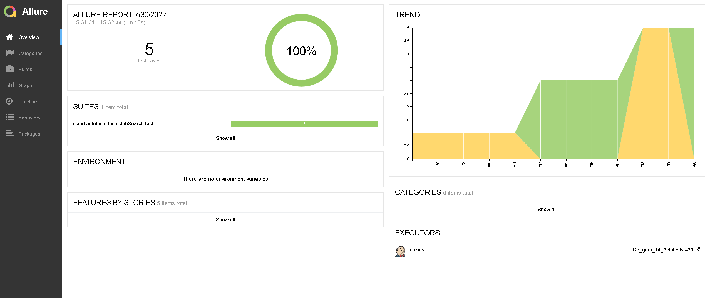
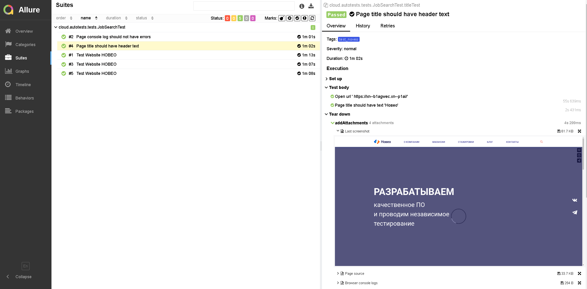
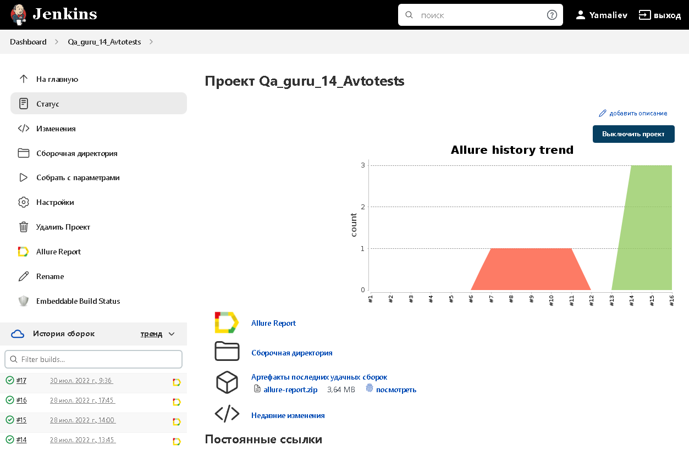
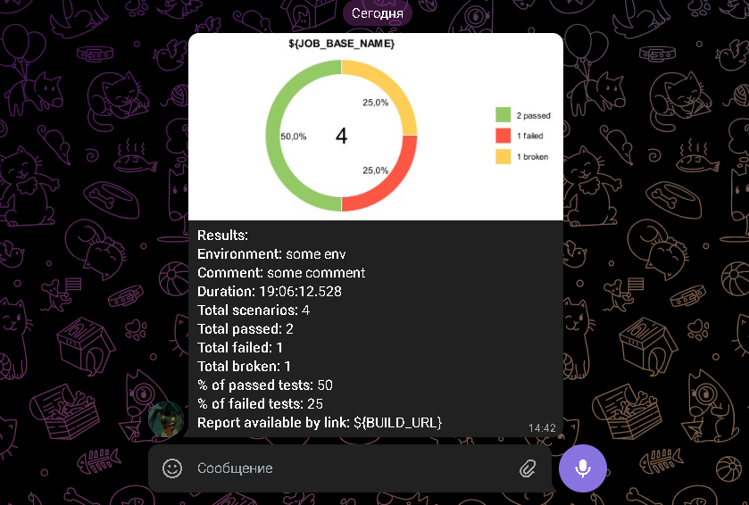

Проект по автоматизации НОВЕО

Технологии и инструменты
## :hotsprings: Технологии и инструменты
<p align="center">


</p>

## :hotsprings: Проверки
Тест 1:
- Открыть сайт НОВЕО.РФ
- Нажать кнопку поиска
- Ввести вакансию Тестировщик
- Выбрать вакансию
- Проверить корректность текста в шапке

Тест 2:
- Открыть сайт НОВЕО.РФ
- Проверка названия в шапке сайта

## :hotsprings: Allure Report
https://jenkins.autotests.cloud/job/Qa_guru_14_Avtotests/
### 
<p align="center">

</p>

## :hotsprings: Сборка в Jenkins
### <a target="_blank" href="https://jenkins.autotests.cloud/job/Nikkitox-QAGuru-DomruTests/">Сборка в Jenkins</a>
<p align="center">

</p>

### Параметры сборки в Jenkins:
Сборка в Jenkins

- browser (браузер, default browser chrome)
- size (размер окна браузера, default size 1920x1080)
- threads (количество потоков)


## :hotsprings: Запуск из терминала
Локальный запуск:
```
gradle clean test
```

Удаленный запуск:
```
clean
test
-Dbrowser=${BROWSER}
-Dsize=${BROWSER_SIZE}
-Dthreads=${THREADS}
```
## :hotsprings: Отчет в Telegram
<p align="center">

</p>

## :hotsprings: Примеры прохождения тестов
- К каждому тесту в Allure Report прилагается видео. Пример ниже
<p align="center">
  
</p>